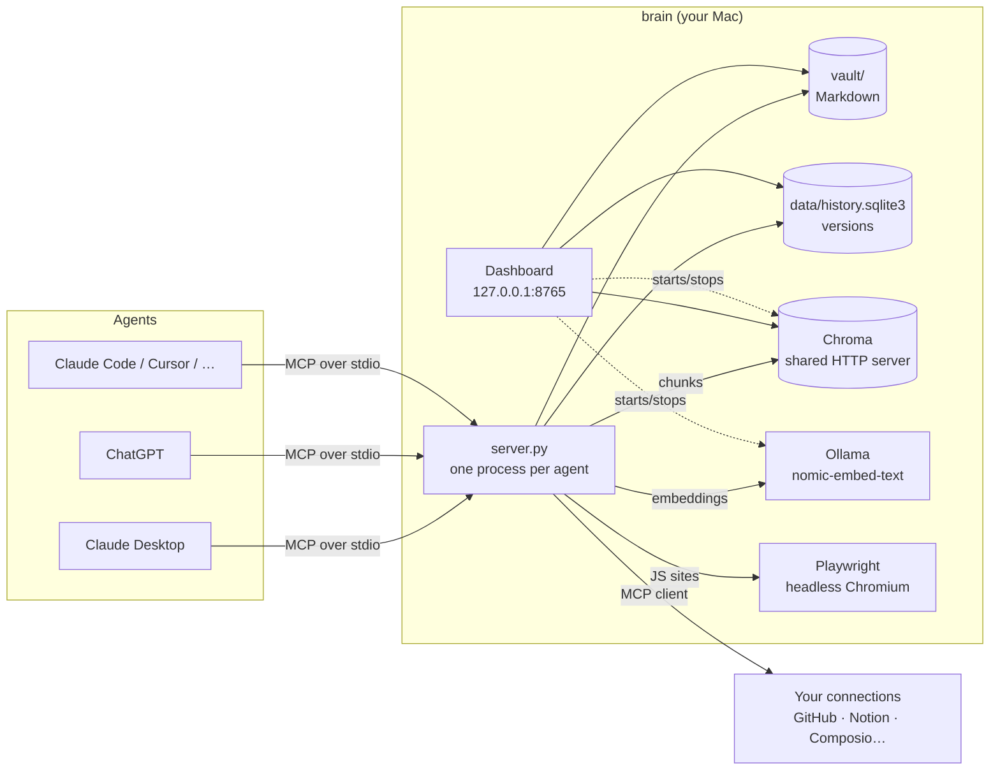

# brain

**Your local second brain for Claude, ChatGPT and any AI agent.**

brain is an [MCP](https://modelcontextprotocol.io) server that runs on your Mac and gives your AI agents a shared memory: your notes, your projects, what they know about you and the web pages you saved, with semantic search. Connect it once to Claude, ChatGPT, Cursor or whatever agent you use, and they all read and write the same knowledge base. Everything stays on your computer.

It ships with a web dashboard so you never have to touch the terminal: turn services on and off, fill in your profile, import the memory other chatbots have about you, connect agents, explore the connection graph and search what you saved.

```bash
curl -fsSL https://raw.githubusercontent.com/Lautaro005/brain/main/install.sh | bash
```

Then type `brain` and the dashboard opens.

**Website:** https://lautaro005.github.io/brain/ · **Docs:** https://lautaro005.github.io/brain/docs/ · **Changelog:** https://lautaro005.github.io/brain/changelog/

---

## Contents

- [What you can do](#what-you-can-do)
- [Installation](#installation)
- [Getting started](#getting-started)
- [The dashboard](#the-dashboard)
- [Connecting agents](#connecting-agents)
- [How it works](#how-it-works)
- [Connections](#connections)
- [MCP tools](#mcp-tools)
- [The `brain` command](#the-brain-command)
- [Data, privacy and security](#data-privacy-and-security)
- [Troubleshooting](#troubleshooting)
- [Uninstalling](#uninstalling)
- [Development](#development)
- [License](#license)
- [Security](#security)

---

## What you can do

- **Let your agents know you.** Write a profile (who you are, what you do, how you like to work) and import the memory ChatGPT, Claude or Gemini already have about you. Every connected agent reads it when it starts and saves anything new it learns with `add_memory`.
- **One knowledge base, shared by every agent.** Markdown notes organized into projects and skills. What Claude writes today, ChatGPT can read tomorrow.
- **Save the web.** Give brain a URL and it downloads the page, extracts the text (including sites built with JavaScript), indexes it and makes it available to semantic search: you search by meaning, not exact words.
- **Chat with your memory.** A local Ollama model that already knows your profile and memory. Ask it things, or have it save, add or edit notes for you. Chats are kept in Chroma, and you can pop the chat out into a floating window that stays on top of your other apps.
- **See how everything connects.** An interactive graph shows your profile, memories, projects, skills, sources and tags, and how they relate.
- **Undo anything.** Every write goes into a version history. If an agent deletes or overwrites something, you get it back.
- **Bring your apps along.** Plug other MCP servers into brain (GitHub, Notion, Gmail…, or hundreds of apps through Composio): their tools show up in every agent you connected, and whatever they fetch is saved to your memory automatically.
- **Private by design.** Embeddings are computed on your machine with [Ollama](https://ollama.com), and nothing leaves your computer.

## Installation

**Requirements:** macOS (Apple Silicon or Intel) and git (`xcode-select --install` if you don't have it). The installer takes care of the rest.

```bash
curl -fsSL https://raw.githubusercontent.com/Lautaro005/brain/main/install.sh | bash
```

The installer:

1. Installs [uv](https://docs.astral.sh/uv/) if you don't have it (it manages Python and the dependencies without touching the system Python).
2. Downloads brain into `~/.brain`.
3. Installs the dependencies and the headless Chromium used to scrape JavaScript sites.
4. Installs [Ollama](https://ollama.com) with Homebrew if needed, and pulls the `nomic-embed-text` embedding model (~270 MB). Without Homebrew, it tells you where to download Ollama. The chat model (`llama3.2`, ~2 GB) is **optional** and not pulled automatically: it powers the Chat tab, source summaries (`abstract`) and entity extraction for the graph. Get it with `ollama pull llama3.2` or the *Download llama3.2* button in the Chat tab; without it those three features are skipped and everything else works. Use another model with `BRAIN_SUMMARY_MODEL=<model>`, or turn summaries and entities off with `BRAIN_SUMMARY_MODEL=off`.
5. Creates the `brain` command in `~/.local/bin` and adds it to your `PATH` if it wasn't there.

Running it again updates the install. To install somewhere else, set `BRAIN_HOME=~/some/folder` before `bash`.

<details>
<summary>Manual installation</summary>

```bash
git clone https://github.com/Lautaro005/brain ~/.brain && cd ~/.brain
uv sync
uv run playwright install chromium
ollama pull nomic-embed-text
./brain.sh
```
</details>

## Getting started

1. **Open the dashboard:** `brain`. It opens at `http://127.0.0.1:8765` and starts Ollama and the Chroma server if they aren't running. Keep it open while you use your agents; Ctrl+C closes it.
2. **Connect your agents:** **Connect agent** tab → *Connect* on Claude Desktop, ChatGPT or whichever you use.
3. **Tell it who you are:** **Profile** tab → fill in "About you" and import your memory from another chatbot.
4. **Try it:** in Claude, ask *"what do you know about me according to brain?"* or *"save this URL to brain: …"*.

## The dashboard

| Tab | What it's for |
|---|---|
| **Dashboard** | Switches to turn **Chroma**, **Ollama** and the **MCP Inspector** (a UI to try the tools by hand) on and off. Vault metrics, activity charts for the last 30 days, sources by domain, operations, system health and recent changes. |
| **Chat** | Talk to a local Ollama model with your profile, all your memories, the `BRAIN.md` index and related bits of past chats as context. It gets the same tools your agents get (read, search, write, `add_memory`, `save_url`, your connections…), so it can look things up and make changes. Every tool call is listed in the answer, and you can expand each one to see its arguments and result; every write lands in the version history. Models that can't take native tools (common with GGUF models pulled from Hugging Face) get the tools as text instead, so they can act on the vault too. Pick the model from the ones installed in Ollama (or download `llama3.2` in one click) when you start a chat; it then stays with that chat. A circle next to the send button fills up as the chat uses the model's context window. Rename a chat with the pencil next to its title. Type `/` for commands: **`/organize`** tidies up the vault and its graph with a built-in skill (adapted from [file-organizer](https://github.com/davila7/claude-code-templates/blob/main/cli-tool/components/skills/productivity/file-organizer/SKILL.md)): it asks how you want it organized, proposes a plan and changes only what you approve; `/reflect` brings Reflect's suggestions into the chat; `/new` starts a new chat. Chats are saved in Chroma (`chats` collection) with a searchable list; **Float** opens the chat in an always-on-top window (Document Picture-in-Picture in Chrome, Edge and Arc; a regular pop-up elsewhere). |
| **Profile** | Your details (name, headline, about me) and your memory. The importer takes 3 steps: pick the chatbot, copy a prompt that asks it for all its memory in a fixed format, and paste the answer (or upload a `.txt`, `.md` or `.json`). You get a preview before importing and can drop anything you don't want. **Reflect** reviews your memory and suggests fixes (duplicates, contradictions, notes without entities) without changing anything. |
| **Connect agent** | Connect and disconnect brain from Claude Desktop, ChatGPT, Claude Code, Codex, Cursor, VS Code, Windsurf and Gemini CLI in one click, plus manual setup for anything else. **My connections** lists the agents brain configured, plus any app that used brain (detected from the MCP handshake, so apps where you added brain with an "Add MCP server" form show up the first time they use it) and apps you note by hand. |
| **Connections** | Other MCP servers brain uses on your behalf: add them as a local command or a URL (or through Composio), switch each one on or off, choose whether its results are saved to memory, refresh its tools. |
| **Graph** | Interactive map of the vault: profile, memory, projects, skills, sources, folders, tags and entities. Click a node to see its content and connections. Controls to zoom in, zoom out and **re-center** (also the `0` key or double-clicking the background). |
| **Knowledge** | Save a URL (optionally forcing JavaScript rendering), hybrid search (semantic score, or a *keyword* tag for exact matches), a button to rebuild the keyword index, and the list of saved sources. |
| **Logs** | Live output of every service the dashboard manages. |

The bottom of the sidebar has the theme (system, light or dark), the language (**English / Español**), an **i** button that lists the services (Chroma, Ollama, MCP Inspector) and their state, and **Settings** (the gear), a full view where you can:

- see the installed **version** and **check for updates**: brain asks GitHub for the latest release only when you click the button. If there's a newer one, Settings shows it with a link to the release notes (update with `brain update`) and the gear turns green until you update;
- reorder the **sidebar** and hide the views you don't use (a hidden view is still reachable by its URL, e.g. `#logs`);
- pick the **default chat model**, used when the chat opens and on every new chat;
- write a **system prompt** for the chat: how you want it to answer (tone, format, language, focus), added to brain's own instructions;
- give each graph node type (Brain, Profile, Memory, Projects, Skills, Sources, Notes, Folders, Tags, Entities) its own color, or go back to black and white.

The button next to the logo collapses the sidebar into a narrow rail of icons.

When you close the dashboard, it only stops what it started. If Ollama was already running (for example the menu-bar app), it shows up as **External** and is left alone.

## Connecting agents

Each agent keeps its list of MCP servers in its own file. When you click *Connect*, brain adds its entry without touching the rest of the file, and saves a backup first (`<file>.bak-brain`).

| Agent | Where it's configured | Notes |
|---|---|---|
| **Claude Desktop** (chat and Cowork) | `~/Library/Application Support/Claude/claude_desktop_config.json` | Claude rewrites this file when it quits, so it's edited with the app closed. If it's open, the dashboard offers to quit it, connect and reopen it. |
| **ChatGPT** (desktop app) | `~/.codex/config.toml` | Works in **Codex** and **ChatGPT Work** modes; regular ChatGPT chat doesn't use local servers. Afterwards: *Settings → MCP servers → Restart*. Shares its config with Codex CLI. |
| **Claude Code** | `~/.claude.json` (via `claude mcp add -s user`) | Available in all your projects. |
| **Codex CLI** | `~/.codex/config.toml` | Same config as ChatGPT. |
| **Cursor** | `~/.cursor/mcp.json` | |
| **VS Code** (Copilot, agent mode) | `~/Library/Application Support/Code/User/mcp.json` | |
| **Windsurf** | `~/.codeium/windsurf/mcp_config.json` | |
| **Gemini CLI** | `~/.gemini/settings.json` | |
| **Anything else** | | The dashboard gives you ready-to-copy config as JSON, TOML, a command, or field by field. |

All of them launch the same server (`uv run --directory ~/.brain python server.py`) with absolute paths, so they work from any folder.

### Apps with an "Add MCP server" form

Many apps have a dialog with two options, **Run a command** and **Connect to a URL**. Choose **Run a command**: brain is a local (stdio) server and doesn't expose a URL, so "Connect to a URL" won't work. Pointing it at the dashboard's address returns `403`, because the dashboard only accepts requests from its own page.

| Field | Value |
|---|---|
| Server name | `brain` |
| Executable command | the absolute path to `uv`, e.g. `/Users/you/.local/bin/uv` (`which uv` prints it) |
| Arguments (one per line) | `run`<br>`--directory`<br>`/Users/you/.brain`<br>`python`<br>`server.py` |
| Environment | empty |

The **Connect agent** tab shows these values already filled in for your machine, each with a copy button. Once the app uses brain for the first time, it appears under **My connections** on its own.

## Connections

brain is also an MCP **client**. In the **Connections** tab you add other MCP servers, and brain re-exposes their tools to every agent you connected, prefixed with the connection's name (`github__create_issue`, `composio__GMAIL_FETCH_EMAILS`) so they never clash with brain's own tools.

- **Local command** (recommended): an MCP server that runs on your Mac, e.g. `npx -y @modelcontextprotocol/server-github` with `GITHUB_TOKEN=…`. The token stays on your machine.
- **URL**: a remote MCP server, with optional headers (`Authorization: Bearer …`).
- **Composio** (optional). **Composio stores your accounts' OAuth tokens in its own cloud**; brain keeps the key, the configuration and everything it fetches locally. Two kinds of key work:
  - **Consumer key** (`ck_…`, the usual one from [dashboard.composio.dev](https://dashboard.composio.dev)): paste it and click *Save and connect*. brain connects to `https://connect.composio.dev/mcp` with the `x-consumer-api-key` header, and the apps you already linked in Composio come with it. No user ID needed.
  - **Project key** (`ak_…`): fill in the user ID, click *Choose apps*, pick the auth configs, and brain creates the MCP server through Composio's developer API (`x-api-key`).
  - *Disconnect* removes the Composio connection and wipes the key from `.env`.

Every connection has two switches: **Active** (turn it off and its tools disappear from your agents right away) and **Save to memory**. With the second one on, each result is written to `vault/knowledge/connections/<connection>/…md` (or `knowledge/composio/<app>/…`), with the tool name, arguments and time in its frontmatter, and indexed in Chroma: what you fetched from GitHub or Gmail becomes searchable with `search_knowledge` and shows up in the graph.

Secrets (env values, headers, the Composio API key) live in `~/.brain/.env` with `600` permissions, outside the vault and never committed. The connection list lives in `~/.brain/data/connections.json`.

## How it works



**Pieces:**

- **MCP server (`server.py`).** Each agent launches its own process and talks to it over stdio (MCP's standard for local servers). It exposes the [tools](#mcp-tools) and tells the model to read `BRAIN.md`, your profile and your memory first.
- **Vault (`~/.brain/vault/`).** Markdown files with YAML frontmatter:
  - `BRAIN.md`: a short index the agent reads first.
  - `profile.md`: your profile.
  - `memory/`: one file per category ("Work", "Preferences"…) with one fact per bullet.
  - `projects/` and `skills/`: your notes and reusable instructions.
  - `knowledge/sources/`: the full text of every saved URL.
- **History (`data/history.sqlite3`).** Every write stores the file's previous and new content. A cross-process file lock makes writes atomic, so Claude, ChatGPT and the dashboard can write at the same time without clobbering each other.
- **Chroma.** The vector database behind semantic search. It runs as a single HTTP server on `127.0.0.1:8055`, so every process shares it without fighting over the disk.
- **Ollama.** Computes embeddings on your machine with `nomic-embed-text`, using the prefixes the model expects (`search_document:` when indexing, `search_query:` when searching).

**What happens when you save a URL (`save_url`):**

1. [trafilatura](https://trafilatura.readthedocs.io) downloads the page and extracts clean text.
2. If it gets fewer than 30 words (typical of JavaScript-built sites) or the download fails, it renders the page in headless Chromium with Playwright and extracts again.
3. It splits the text into ~500-word chunks with a 50-word overlap.
4. It embeds each chunk with Ollama and stores it in Chroma, with metadata pointing back to the source `.md`. The same chunks go into a keyword index (SQLite FTS5, `data/search.sqlite3`), which catches proper names, IDs and exact numbers that embeddings miss.
5. If a chat model is installed in Ollama, it adds a short `abstract` (pages over 800 words) and the `entities` it names (people, places, organizations, projects) to the frontmatter. Both are optional: without the model the page is saved the same way.
6. It writes `knowledge/sources/<slug>.md` with the full text and its chunk ids. Saving the same URL again updates it instead of duplicating it.

**Search (`search_knowledge`)** runs the semantic search and the keyword search, and merges both lists with reciprocal rank fusion. If Chroma or Ollama is down, keyword search keeps working and the answer says so.

**Memory over time:** each fact carries the date it was saved (an HTML comment at the end of the bullet, invisible when reading). When a fact changes, `add_memory(new, supersede=old)` moves the old one to a `## Historial` section with the date it stopped being true, so agents only see what's current and the past isn't lost.

**Entities in the graph:** notes in `knowledge/` and `memory/` get an `entities` list. Two notes that name the same person or project end up connected through a shared entity node, even if nobody linked them.

**Reflect** (Profile tab) reviews what's stored and suggests fixes: facts duplicated across categories, facts that probably contradict each other, and recent notes without entities. It never writes anything; each suggestion shows the tool call that would apply it.

**How memory import works:** the dashboard's prompt asks the chatbot for its memory grouped as `## Category` / `- fact`. The parser also accepts plain lists, bold labels, numbered lists and JSON. It deduplicates, strips date prefixes, and when a memory mentions one of your projects by name, links them in the graph.

## MCP tools

| Tool | What it does |
|---|---|
| `list_vault(prefix?)` | Lists vault files with their description |
| `read_file(path)` | Reads a file |
| `write_file(path, content)` | Creates or replaces a file |
| `append_file(path, content)` | Appends to a file |
| `str_replace_file(path, old, new)` | Targeted replace (`old` must appear exactly once) |
| `set_frontmatter(path, fields)` | Changes metadata (description, tags, related…) without touching the content; `null` removes a field |
| `delete_file(path)` | Deletes a file (recoverable) |
| `file_history(path)` | A file's versions |
| `restore_file(path, version_id)` | Restores a file to an earlier version (also brings back deleted files) |
| `move_file(src, dst)` | Moves or renames a note (recoverable). Not for `BRAIN.md`, `profile.md`, `memory/` or `knowledge/sources/` |
| `vault_overview()` | What's messy in the vault: loose notes, notes with no links or no description, tag variants, similar names |
| `add_memory(fact, category?, supersede?)` | Saves a fact about you to your memory, without duplicates and with the date it was saved. If it replaces an older fact (you moved, changed jobs…), pass the old one in `supersede`: it isn't deleted, it moves to a `## Historial` section of the same file, dated |
| `memory_history(category?)` | Facts that were superseded in a memory category |
| `list_skills()` / `get_skill(name)` | Skills: reusable instructions in `skills/` |
| `distill_skill(topic)` | Gathers everything brain has on a topic (search hits, memories, sources) so the agent can write a skill from it with `write_file`. It doesn't write the skill itself |
| `save_url(url, render_js?)` | Scrapes, indexes and saves a URL (long pages also get a short `abstract`) |
| `search_knowledge(query, top_k?)` | Hybrid search over what you saved: semantic + exact keyword (names, IDs, dates), merged with reciprocal rank fusion |
| `reindex_keyword_search()` | Rebuilds the keyword index from the `.md` files in `knowledge/` (for sources saved before hybrid search existed) |
| `list_sources()` | Every saved URL, with its `abstract` when there is one |
| `list_connections()` | Your connections, whether they're active, and their tools |
| `refresh_connectors()` | Re-discovers the tools of every active connection |
| `<connection>__<tool>` | Any tool from an active connection, proxied (and captured to memory if enabled) |

Every write validates the note's YAML frontmatter. If an agent writes a value that breaks it (typically an unquoted `:` in a description), brain quotes it automatically; if it can't be repaired, the write is rejected with a clear error, so metadata never silently disappears from the graph.

## The `brain` command

```text
brain                 opens the dashboard and starts Ollama and Chroma
brain --port 8766     dashboard on another port
brain --no-autostart  don't start Ollama/Chroma automatically
brain --no-browser    don't open the browser
brain update          updates to the latest version
brain path            shows where it's installed
brain uninstall       removes the command (keeps your data)
brain help            help
```

## Data, privacy and security

- **Everything is local.** Your data lives in `~/.brain/vault/` and `~/.brain/data/`. Both folders are in `.gitignore`, so they're never uploaded anywhere, not even if you fork the repo.
- **No external services by default.** Embeddings are computed with Ollama on your machine. brain only goes online when you save a URL or use a connection that talks to a remote service. Composio, if you use it, keeps your app tokens in its cloud.
- **The dashboard only accepts requests from your own machine.** It listens on `127.0.0.1`, rejects requests with any other `Host` (DNS-rebinding protection), and its actions require a custom header browsers won't send from other pages. No website you have open can start processes or write to your vault.
- **Agents can't leave the vault.** The tools reject paths with `..`, absolute paths, hidden files and symlinks that point outside.
- **Secrets stay out of the vault and the repo.** Connection tokens and API keys are in `~/.brain/.env` (permissions `600`, gitignored); the dashboard never shows them back.
- **Everything can be undone.** Any write can be reverted with `file_history` + `restore_file`.

To start from scratch: close the dashboard and your agents, and delete `~/.brain/vault` and `~/.brain/data`. They're recreated empty on the next start.

## Troubleshooting

| Problem | Fix |
|---|---|
| "Ollama isn't running" | Turn on the Ollama switch in the Dashboard, or open the Ollama app. |
| Search finds nothing for a name you know is saved | Sources saved before v0.02.5 aren't in the keyword index yet: click *Rebuild keyword index* in the Knowledge tab (or ask an agent to run `reindex_keyword_search`). |
| Sources have no `abstract` / the graph has no entities | Those need a chat model in Ollama: `ollama pull llama3.2`. Then run **Reflect** in the Profile tab to see which notes are missing entities. |
| "The Chroma server isn't running" | Open the dashboard (`brain`); it starts Chroma. Agents need it for `save_url` and `search_knowledge`. |
| Composio returns `401 Invalid API key` | Check the key type: a consumer key (`ck_…`) only works with *Save and connect*, not with *Choose apps* (that's for project keys `ak_…`). If it's a fresh key, try regenerating it in Composio's dashboard. |
| An app returns `403` when connecting | You used "Connect to a URL". Use **Run a command** with the values from [Apps with an "Add MCP server" form](#apps-with-an-add-mcp-server-form). |
| brain doesn't show up in Claude Desktop | Connect it from **Connect agent** and restart Claude. Check **My connections**. |
| brain doesn't show up in ChatGPT | Use **Codex** or **ChatGPT Work** mode and go to *Settings → MCP servers → Restart*. Regular chat doesn't use local servers. |
| The chat says there's no chat model | Click *Download llama3.2* in the Chat tab, or run `ollama pull llama3.2` (any chat model works; models with tool support can also edit your vault). |
| The chat answers but can't save or edit anything | Open the actions under the answer to see what failed. Very small models sometimes don't follow the tool format; try a larger one (for example `llama3.2`, `qwen2.5` or `mistral`). |
| "Couldn't extract text from that URL" | The site may be paywalled or require a login. Try *Force JS rendering*. |
| `brain: command not found` | Open a new terminal. If it persists, add `export PATH="$HOME/.local/bin:$PATH"` to your `~/.zshrc`. |
| Port 8765 is taken | `brain --port 8766` |

## Uninstalling

1. In the dashboard, **Connect agent** → disconnect your agents (or remove the `brain` entry from their config).
2. `brain uninstall` removes the command.
3. `rm -rf ~/.brain` deletes the app **and your data**.

## Development

- [`CLAUDE.md`](CLAUDE.md): technical guide for agents working on the repo (architecture, conventions and gotchas).
- [`CHANGES.md`](CHANGES.md): the log of every change and decision. New changes are appended at the end.
- [`BUILD.md`](BUILD.md): the original spec.
- [`docs/`](docs/): the website, published with GitHub Pages.

```bash
git clone https://github.com/Lautaro005/brain && cd brain
uv sync && ./brain.sh
```

The dashboard UI is available in English and Spanish; the internal docs (`CLAUDE.md`, `CHANGES.md`, `BUILD.md`) are in Spanish.

## License

[MIT with the Commons Clause](LICENSE) © 2026 Lautaro Silva.

You can use, study, modify and share brain for free, including at work. The Commons Clause adds one restriction: you may not **sell** it, meaning you can't charge third parties for a product or service (hosting, support or consulting included) whose value comes entirely or substantially from brain. Versions released before `v0.02.0` stay under plain MIT.

Both parts are in [`LICENSE`](LICENSE): the Commons Clause condition first, then the MIT text. Because of that condition GitHub shows the license as "Other" instead of "MIT"; that is expected, since plain MIT would allow selling it.

## Security

To report a vulnerability, see [`SECURITY.md`](SECURITY.md). Please don't open a public issue for it.
