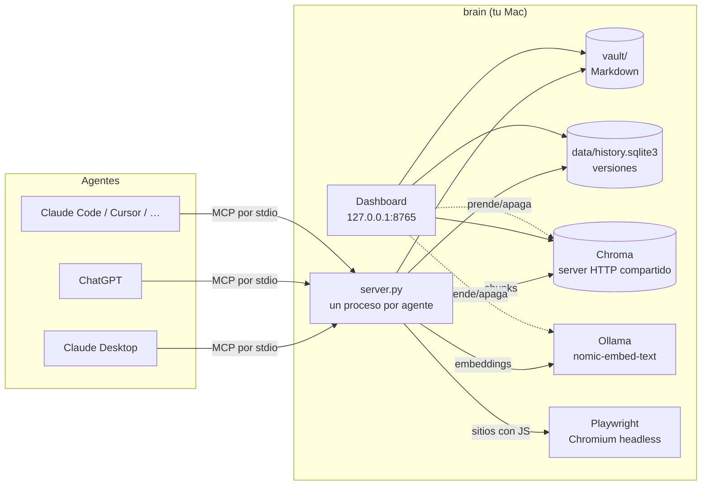

# brain

**Tu segundo cerebro local para Claude, ChatGPT y cualquier agente de IA.**

brain es un servidor [MCP](https://modelcontextprotocol.io) que corre en tu Mac y le da a tus agentes de IA una memoria compartida: tus notas, tus proyectos, lo que saben de vos y las páginas web que guardaste, con búsqueda semántica. Lo conectás una vez a Claude, ChatGPT, Cursor o el agente que uses, y todos leen y escriben la misma base de conocimiento. Todo queda en tu computadora.

Incluye un dashboard web para manejarlo sin tocar la terminal: prender servicios, cargar tu perfil, importar la memoria de otros chatbots, conectar agentes, ver el grafo de conexiones y buscar en lo guardado.

```bash
curl -fsSL https://raw.githubusercontent.com/Lautaro005/brain/main/install.sh | bash
```

Después escribís `brain` y se abre el dashboard.

---

## Contenido

- [Qué podés hacer](#qué-podés-hacer)
- [Instalación](#instalación)
- [Primeros pasos](#primeros-pasos)
- [El dashboard](#el-dashboard)
- [Conectar agentes](#conectar-agentes)
- [Cómo funciona](#cómo-funciona)
- [Tools MCP](#tools-mcp)
- [El comando `brain`](#el-comando-brain)
- [Datos, privacidad y seguridad](#datos-privacidad-y-seguridad)
- [Solución de problemas](#solución-de-problemas)
- [Desinstalar](#desinstalar)
- [Desarrollo](#desarrollo)

---

## Qué podés hacer

- **Que tus agentes te conozcan.** Cargás un perfil ("quién soy, a qué me dedico, cómo me gusta trabajar") e importás la memoria que ChatGPT, Claude o Gemini ya tienen de vos. Cualquier agente conectado la lee al empezar, y guarda lo nuevo que aprende con `add_memory`.
- **Una base de conocimiento que comparten todos.** Notas en Markdown organizadas en proyectos y skills. Lo que Claude escribe hoy, ChatGPT lo puede leer mañana.
- **Guardar la web.** Pasás una URL y brain la descarga, extrae el texto (también de sitios que dependen de JavaScript), la indexa y la deja disponible para búsqueda semántica: buscás por significado, no por palabras exactas.
- **Ver cómo se conecta todo.** Un grafo interactivo muestra tu perfil, tus memorias, proyectos, skills, fuentes y tags, y cómo se relacionan entre sí.
- **Deshacer cualquier cambio.** Cada escritura queda en un historial de versiones. Si un agente borra o pisa algo, lo recuperás.
- **Privado por diseño.** Los embeddings se calculan con [Ollama](https://ollama.com) en tu máquina y nada sale de tu computadora.

## Instalación

**Requisitos:** macOS (Apple Silicon o Intel) y git (`xcode-select --install` si no lo tenés). Lo demás lo resuelve el instalador.

```bash
curl -fsSL https://raw.githubusercontent.com/Lautaro005/brain/main/install.sh | bash
```

El instalador:

1. Instala [uv](https://docs.astral.sh/uv/) si no lo tenés (maneja Python y las dependencias, sin tocar el Python del sistema).
2. Descarga brain en `~/.brain`.
3. Instala las dependencias y el Chromium headless que se usa para scrapear sitios con JavaScript.
4. Instala [Ollama](https://ollama.com) con Homebrew si hace falta, y baja el modelo de embeddings `nomic-embed-text` (~270 MB). Si no tenés Homebrew, te indica dónde descargar Ollama.
5. Crea el comando `brain` en `~/.local/bin` y lo agrega a tu `PATH` si no estaba.

Correrlo de nuevo actualiza la instalación. Para instalar en otra carpeta: `BRAIN_HOME=~/otra/carpeta` antes del `bash`.

<details>
<summary>Instalación manual</summary>

```bash
git clone https://github.com/Lautaro005/brain ~/.brain && cd ~/.brain
uv sync
uv run playwright install chromium
ollama pull nomic-embed-text
./brain.sh
```
</details>

## Primeros pasos

1. **Abrí el dashboard:** `brain`. Se abre en `http://127.0.0.1:8765` y prende Ollama y el server de Chroma si no estaban corriendo. Dejalo abierto mientras usás tus agentes; Ctrl+C lo cierra.
2. **Conectá tus agentes:** pestaña **Conectar agente** → *Conectar* en Claude Desktop, ChatGPT o el que uses.
3. **Contale quién sos:** pestaña **Perfil** → completá "Sobre vos" e importá tu memoria desde otro chatbot.
4. **Probalo:** en Claude, preguntá *"¿qué sabés de mí según brain?"* o *"guardá esta URL en brain: …"*.

## El dashboard

| Pestaña | Para qué sirve |
|---|---|
| **Panel** | Switches para prender y apagar **Chroma**, **Ollama** y el **Inspector MCP** (una UI para probar las tools a mano). Métricas del vault, gráficos de actividad de los últimos 30 días, fuentes por dominio, operaciones, salud del sistema y últimos cambios. |
| **Perfil** | Tus datos (nombre, una línea, sobre mí) y tu memoria. El importador tiene 3 pasos: elegís el chatbot, copiás un prompt que le pide toda tu memoria en un formato fijo, y pegás la respuesta (o subís un `.txt`, `.md` o `.json`). Antes de importar ves una vista previa y podés sacar lo que no quieras. |
| **Conectar agente** | Conectar y desconectar brain de Claude Desktop, ChatGPT, Claude Code, Codex, Cursor, VS Code, Windsurf y Gemini CLI con un click, más la configuración manual para cualquier otro. En **Mis conexiones** ves qué agentes están conectados y si apuntan a esta instalación. |
| **Grafo** | Mapa interactivo del vault: perfil, memoria, proyectos, skills, fuentes, carpetas y tags. Click en un nodo para ver su contenido y conexiones. Controles para acercar, alejar y **volver al centro** (también con la tecla `0` o doble click en el fondo). |
| **Conocimiento** | Guardar una URL (con la opción de forzar el render con JavaScript), búsqueda semántica con porcentaje de relevancia, y la lista de fuentes guardadas. |
| **Logs** | La salida en vivo de cada servicio que maneja el dashboard. |

En la parte de abajo del menú lateral están el tema (sistema, claro u oscuro) y el idioma (**español / English**).

Cuando cerrás el dashboard, apaga solo lo que prendió él. Si Ollama ya estaba abierto (por ejemplo, la app de la barra de menú), aparece como **Externo** y no se toca.

## Conectar agentes

Cada agente guarda su lista de servers MCP en su propio archivo. Al tocar *Conectar*, brain agrega su entrada sin tocar el resto del archivo y guarda antes un backup (`<archivo>.bak-brain`).

| Agente | Dónde se configura | Notas |
|---|---|---|
| **Claude Desktop** (chat y Cowork) | `~/Library/Application Support/Claude/claude_desktop_config.json` | Claude reescribe este archivo al cerrarse, así que se edita con la app cerrada. Si está abierta, el dashboard ofrece cerrarla, conectar y volver a abrirla. |
| **ChatGPT** (app de escritorio) | `~/.codex/config.toml` | Funciona en los modos **Codex** y **ChatGPT Work**; el chat común de ChatGPT no usa servers locales. Después: *Settings → MCP servers → Restart*. Comparte la config con Codex CLI. |
| **Claude Code** | `~/.claude.json` (vía `claude mcp add -s user`) | Queda disponible en todos tus proyectos. |
| **Codex CLI** | `~/.codex/config.toml` | La misma config que ChatGPT. |
| **Cursor** | `~/.cursor/mcp.json` | |
| **VS Code** (Copilot, modo agente) | `~/Library/Application Support/Code/User/mcp.json` | |
| **Windsurf** | `~/.codeium/windsurf/mcp_config.json` | |
| **Gemini CLI** | `~/.gemini/settings.json` | |
| **Cualquier otro** | | El dashboard te da la configuración lista para copiar en JSON, TOML o como comando. |

Todos lanzan el mismo server (`uv run --directory ~/.brain python server.py`) con paths absolutos, así que funcionan desde cualquier carpeta.

## Cómo funciona



**Piezas:**

- **Server MCP (`server.py`).** Cada agente lanza su propio proceso y se comunica con él por stdio (el estándar de MCP para servers locales). Expone las [tools](#tools-mcp) y le indica al modelo que lea primero `BRAIN.md`, tu perfil y tu memoria.
- **Vault (`~/.brain/vault/`).** Archivos Markdown con frontmatter YAML:
  - `BRAIN.md`: índice corto que el agente lee primero.
  - `profile.md`: tu perfil.
  - `memory/`: un archivo por categoría ("Trabajo", "Preferencias"…) con un hecho por viñeta.
  - `projects/` y `skills/`: tus notas e instrucciones reutilizables.
  - `knowledge/sources/`: el texto completo de cada URL guardada.
- **Historial (`data/history.sqlite3`).** Cada escritura guarda el contenido anterior y el nuevo del archivo. Un lock de archivo entre procesos hace atómicas las escrituras, así que Claude, ChatGPT y el dashboard pueden escribir a la vez sin pisarse.
- **Chroma.** La base vectorial de la búsqueda semántica. Corre como server HTTP único en `127.0.0.1:8055` para que todos los procesos lo compartan sin conflictos de acceso a disco.
- **Ollama.** Genera los embeddings en tu máquina con `nomic-embed-text`, usando los prefijos que el modelo espera (`search_document:` al indexar, `search_query:` al buscar).

**Qué pasa cuando guardás una URL (`save_url`):**

1. [trafilatura](https://trafilatura.readthedocs.io) descarga la página y extrae el texto limpio.
2. Si saca menos de 30 palabras (típico de sitios que se arman con JavaScript) o la descarga falla, renderiza la página en Chromium headless con Playwright y extrae de nuevo.
3. Parte el texto en chunks de ~500 palabras con 50 de solapamiento.
4. Calcula el embedding de cada chunk con Ollama y lo guarda en Chroma, con metadata que apunta al `.md` de origen.
5. Escribe `knowledge/sources/<slug>.md` con el texto completo y los ids de sus chunks. Si la URL ya estaba guardada, la actualiza en vez de duplicarla.

**Cómo se importa la memoria:** el prompt del dashboard le pide al chatbot su memoria agrupada en `## Categoría` / `- dato`. El parser también acepta listas planas, etiquetas en negrita, listas numeradas y JSON. Deduplica, limpia prefijos de fecha, y si una memoria menciona por nombre uno de tus proyectos, la relaciona con él en el grafo.

## Tools MCP

| Tool | Qué hace |
|---|---|
| `list_vault(prefix?)` | Lista los archivos del vault con su descripción |
| `read_file(path)` | Lee un archivo |
| `write_file(path, content)` | Crea o reemplaza un archivo |
| `append_file(path, content)` | Agrega al final de un archivo |
| `str_replace_file(path, old, new)` | Reemplazo puntual (`old` tiene que aparecer exactamente una vez) |
| `delete_file(path)` | Borra un archivo (recuperable) |
| `file_history(path)` | Versiones de un archivo |
| `restore_file(path, version_id)` | Vuelve un archivo a una versión anterior (también recupera borrados) |
| `add_memory(fact, category?)` | Guarda un hecho sobre vos en tu memoria, sin duplicar |
| `list_skills()` / `get_skill(name)` | Skills: instrucciones reutilizables en `skills/` |
| `save_url(url, render_js?)` | Scrapea, indexa y guarda una URL |
| `search_knowledge(query, top_k?)` | Búsqueda semántica en lo guardado |
| `list_sources()` | Todas las URLs guardadas |

## El comando `brain`

```text
brain                 abre el dashboard y prende Ollama y Chroma
brain --port 8766     dashboard en otro puerto
brain --no-autostart  no prender Ollama/Chroma solos
brain --no-browser    no abrir el navegador
brain update          actualiza a la última versión
brain path            muestra dónde está instalado
brain uninstall       saca el comando (no borra tus datos)
brain help            ayuda
```

## Datos, privacidad y seguridad

- **Todo es local.** Tus datos viven en `~/.brain/vault/` y `~/.brain/data/`. Esas carpetas están en el `.gitignore`, así que nunca se suben a ningún lado, ni siquiera si hacés un fork.
- **Sin servicios externos.** Los embeddings se calculan con Ollama en tu máquina. Solo se sale a internet cuando pedís guardar una URL.
- **El dashboard solo acepta pedidos de tu propia máquina.** Escucha en `127.0.0.1`, rechaza pedidos con otro `Host` (protección contra DNS rebinding) y sus acciones exigen un header propio que el navegador no deja enviar desde otras páginas. Ningún sitio web que tengas abierto puede prender procesos ni escribir en tu vault.
- **Los agentes no pueden salir del vault.** Las tools rechazan paths con `..`, paths absolutos, archivos ocultos y symlinks que apunten afuera.
- **Todo se puede deshacer.** Cualquier escritura se puede revertir con `file_history` + `restore_file`.

Para empezar de cero: cerrá el dashboard y los agentes, y borrá `~/.brain/vault` y `~/.brain/data`. Se recrean vacíos al volver a abrir.

## Solución de problemas

| Problema | Solución |
|---|---|
| "Ollama no está corriendo" | Prendé el switch de Ollama en el Panel, o abrí la app Ollama. |
| "El server de Chroma no está corriendo" | Abrí el dashboard (`brain`): prende Chroma solo. Los agentes lo necesitan para `save_url` y `search_knowledge`. |
| brain no aparece en Claude Desktop | Conectalo desde **Conectar agente** y reiniciá Claude. Revisá **Mis conexiones**. |
| brain no aparece en ChatGPT | Usá el modo **Codex** o **ChatGPT Work** y hacé *Settings → MCP servers → Restart*. El chat común no usa servers locales. |
| "No se pudo extraer texto de esa URL" | El sitio puede tener paywall o pedir login. Probá con *Forzar render con JS*. |
| `brain: command not found` | Abrí una terminal nueva. Si sigue, agregá `export PATH="$HOME/.local/bin:$PATH"` a tu `~/.zshrc`. |
| El puerto 8765 está ocupado | `brain --port 8766` |

## Desinstalar

1. En el dashboard, **Conectar agente** → desconectá los agentes (o sacá la entrada `brain` de sus configs).
2. `brain uninstall` saca el comando.
3. `rm -rf ~/.brain` borra la app **y tus datos**.

## Desarrollo

- [`CLAUDE.md`](CLAUDE.md): guía técnica para agentes que trabajen en el repo (arquitectura, convenciones y detalles a tener en cuenta).
- [`CHANGES.md`](CHANGES.md): el registro de cada cambio y decisión. Cada cambio nuevo se agrega al final.
- [`BUILD.md`](BUILD.md): la especificación original.

```bash
git clone https://github.com/Lautaro005/brain && cd brain
uv sync && ./brain.sh
```
